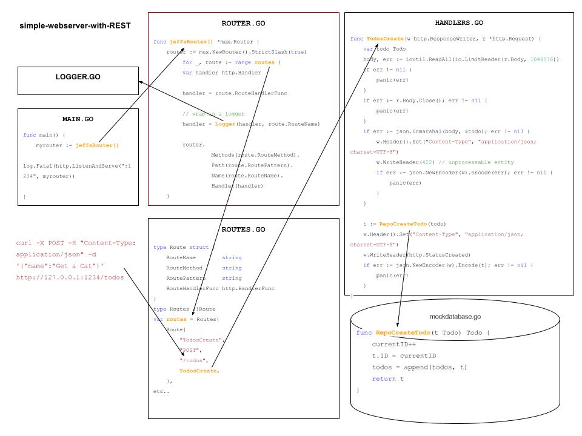

# simple-webserver-with-REST example

`simple-webserver-TEST` _adding REST to
[simple-webserver](https://github.com/JeffDeCola/my-go-examples/tree/master/simple-webserver)._

[GitHub Webpage](https://jeffdecola.github.io/my-go-examples/)

## MOCK DATABASE

In this example a mock database will be used.

## HIGH-LEVEL VIEW OF CODE



## RUN

```bash
go run simple-webserver-with-REST.go router.go routes.go handlers.go logger.go mockdatabase.go
```

In a browser,

```bash
http 127.0.0.1:1234
```
