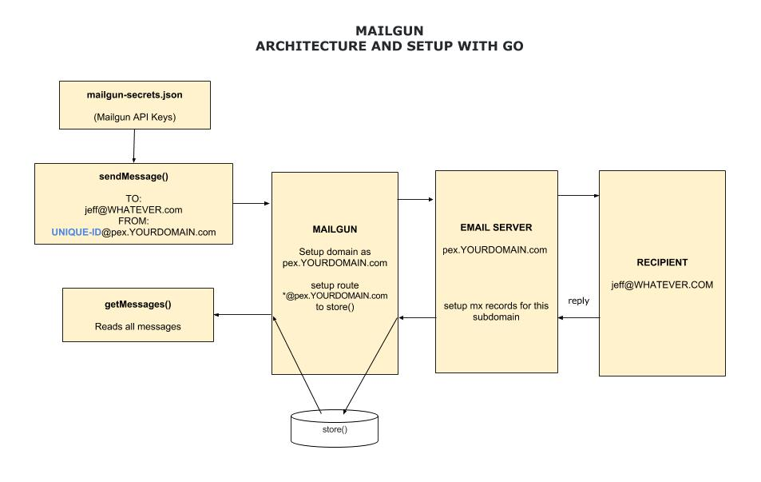

# track-email-mailgun-api

`track-email-mailgun-api` _Send and track an email using mailgun over their go client api_

[GitHub Webpage](https://jeffdecola.github.io/my-go-examples/)

Mailgun is used to send emails to recipiants and have them respond.

A unique ID is used to keep track of who the email went to.

## HIGH LEVEL VIEW

## SETUP EMAIL SERVER MX RECORDS

To be able to reply, you may setup a subdomain and
setup mx records to send email to mailgun.

e.g. jeff@pex.YOURDOMAIN.com.  Hence, `pex`, is the subdomain.

CNAME RECORD

* email.`pex`,  mailgun.org

TXT RECORD

* `pex` v=spf1, include:mailgun.org ~all
* k1._domainkey.`pex`, k=rsa; p=SPECIAL_KEY

MX RECORD

* 10, `pex`, mxa.mailgun.org
* 10, `pex`, mxb.mailgun.org

## SETUP MAILGUN ROUTE FOR INCOMING MAIL TO STORE()

Now setup a route that takes the incoming mail and stores it (for up to 3 days).

You can do this online.

match_recipient(".*@`pex`.YOURDOMAIN.com") and set action to store().

## SEND EMAIL

sendMessage()

## GET EMAIL

getMessages()