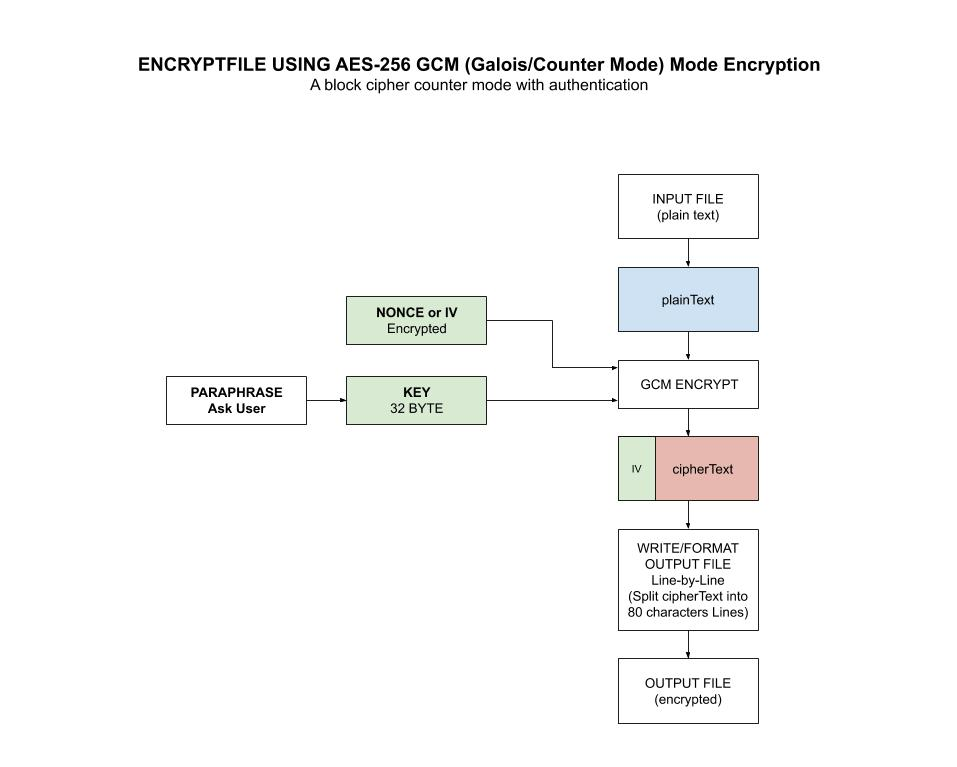

# encryptfile tool

`encryptfile` _is a useful tool for
encryptfile a file with AES-256 GCM (a 32-byte hash key) using the `crypto/aes` package.

Use my other tool
[decryptfile](https://github.com/JeffDeCola/my-go-examples/tree/master/useful-tools-i-created/decryptfile)
to decrypt.

[GitHub Webpage](https://jeffdecola.github.io/my-go-examples/)

## RUN

```bash
go run encryptfile <INPUTFILE> <OUTPUTFILE>
```

## INSTALL

```bash
go install encryptfile.go
```

## HOW IT WORKS

The Advanced Encryption Standard, or AES, is a symmetric
block cipher chosen by the U.S. government to protect classified
information and is implemented in software and hardware throughout
the world to encrypt sensitive data.

We're going to use AES-256 GCM encryption from the standard go
[crypto/aes](https://golang.org/pkg/crypto/aes/)
package.

### STEP 1 - LETS CREATE A HASH KEY

First you need a 32 byte key (AES-256).  Instead of typing a 32
character in, lets make it simple by turning a simple paraphrase into a key.
We will use the standard go
[crypto/md5](https://golang.org/pkg/crypto/md5/)
package.

```go
hasher := md5.New()
hasher.Write([]byte(paraphrase))
hash := hex.EncodeToString(hasher.Sum(nil))
```

### STEP 2 - ENCRYPT FILE WITH 32 BYTE HASH KEY

The encryption was done using AES-256 GCM from my example
[aes-gcm](https://github.com/JeffDeCola/my-go-examples/tree/master/encryption-decryption/aes-gcm).

Refer to that example for a complete description.

This illustration may help,


