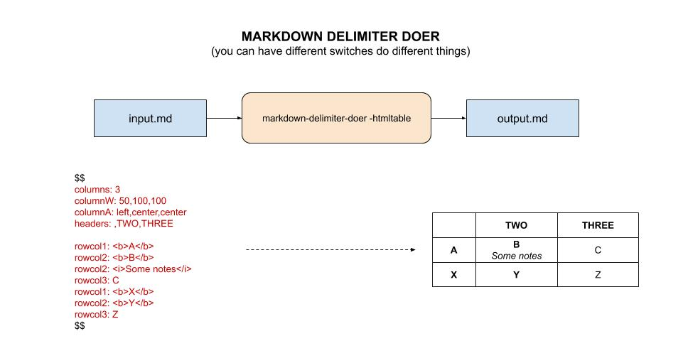

# markdown-delimiter-doer tool

`markdown-delimiter-doer` _is a useful tool for
taking a markdown file and "do whatever you want" between the delimiters
and output new markdown file._

tl;dr,

```bash
markdown-delimiter-doer -htmltable -delimiter \$\$ -i input.md -o output.md
```

[GitHub Webpage](https://jeffdecola.github.io/my-go-examples/)

## RUN

Run using delimiters `$$` and the `-htmltable` switch,

```bash
go run markdown-delimiter-doer.go -htmltable -delimiter \$\$ -i input.md -o output.md
```

To install (place an executable in your $GOPATH/bin),

## INSTALL

```bash
go install markdown-delimiter-doer.go
```

## SWITCHES

You can make many different switches to do different things.

### HTML TABLE SWITCH

Here is an illustration using the `-htmltable` switch,



It will even check the dates and strikethrough them automatically.
