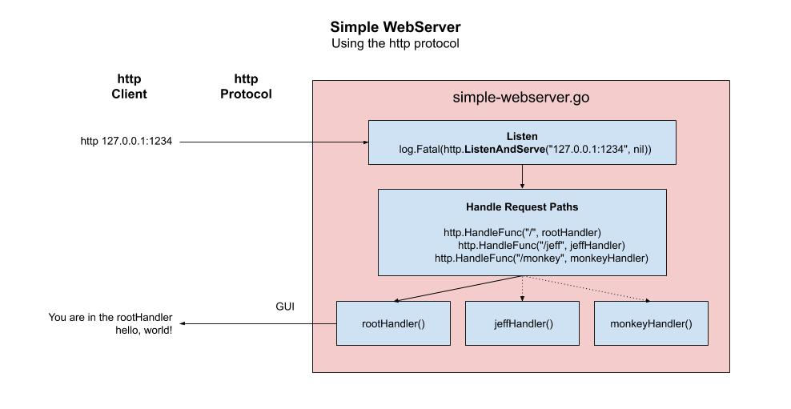

# simple-webserver-with-reactJS example

```text
*** THE REPO IS UNDER CONSTRUCTION - CHECK BACK SOON ***
```

_TBD._

[GitHub Webpage](https://jeffdecola.github.io/my-go-examples/)

## HOW IT WORKS


## HOW IT WORKS

The `????` package lets us map request paths to functions.

1. Set which IP and port you would like to listen on,

    ```go
    log.Fatal(http.ListenAndServe("127.0.0.1:1234", nil))
    ```

1. When a request is made for a particular URL kick off your function,

    ```go
    http.HandleFunc("/jeff", jeffHandler)
    ```

1. Create your handler function `jeffHandler`,

    ```go
    func jeffHandler(res http.ResponseWriter, req *http.Request) {
        fmt.Printf("req is %+v\n\n", req.URL)
        io.WriteString(res, "hello, Jeff!\n")
    }
    ```

This illustration may help,



## RUN

```bash
go run simple-webserver.go
```

Press return to exit.

You can interact with the web server many different ways.

### USING A BROWSER

[http://127.0.0.1:1234/](http://127.0.0.1:1234/)

[http://127.0.0.1:1234/jeff](http://127.0.0.1:1234/jeff)

[http://127.0.0.1:1234/monkey](http://127.0.0.1:1234/monkey)

### USING HTTPIE

In another terminal, use a CLI http client like
httpie and you can do the following,

```bash
http localhost:1234
http localhost:1234/jeff
http localhost:1234/monkey
```

Or you can use the IP Address,

```bash
http 127.0.0.1:1234
http 127.0.0.1:1234/jeff
http 127.0.0.1:1234/monkey
```

### USING CURL

Or you can use curl,

```bash
curl 127.0.0.1:1234
curl 127.0.0.1:1234/jeff
curl 127.0.0.1:1234/monkey
```
